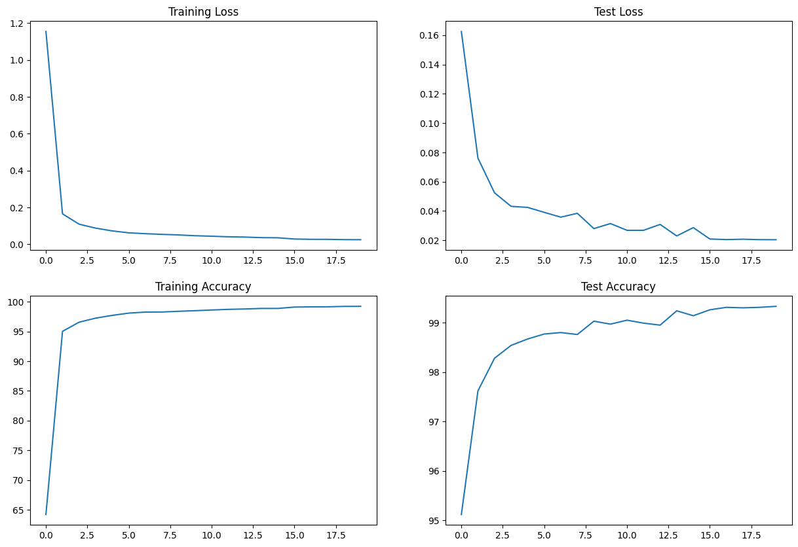

# ERA S5 Assignment

This repository contains the solution to the assignment given in The School of AI's ERA Program Session 5. The solution uses PyTorch to train a convolutional neural network on the MNIST dataset. The trained model achieves an accuracy of 99.15% on the test dataset. The code is well-documented and can be easily extended to other datasets and models.


## Pre-requisites

The code is written in Python 3.10.11. It is recommended to use a virtual environment to run the code to avoid dependency issues. Try to use Google Colab or Kaggle to run the code as they provide free access to GPUs. If you are running the code on your local machine, make sure you install the virtual environment before running the code.

### Installing the Virtual Environment

It is advised to install Anaconda to manage the virtual environment. Anaconda can be downloaded from [here](https://www.anaconda.com/products/individual). Once installed, the virtual environment can be created using the following command:

```bash
conda create -n era python=3.10.11
```

### Activating the Virtual Environment

The virtual environment needs to be activated before running the code. This can be done using the following command:

```bash
conda activate era
```

## Installation

1. Clone the repository using the following command:

    ```bash
    git clone https://github.com/ChikkaUdayaSai/ERA-S5-Assignment
    ```

2. Navigate to the repository directory:

    ```bash
    cd ERA-S5-Assignment
    ```

3. Install the dependencies using the following commnad:

    ```bash
    pip install -r requirements.txt
    ```

Note: If you are using Google Colab or Kaggle, you can skip the above step as the dependencies are already installed in the environment. But it is advised to check the versions of the dependencies before running the code.

The code uses PyTorch and Torchvision for fetching the MNIST dataset and training the model. An additional dependency, Matplotlib, is used for plotting the training and validation losses. Finally, the Torchsummary package is used to visualize the model architecture.

We are now ready to run the code with the following versions of the dependencies:

- **PyTorch: 2.0.1**
- **Torchvision: 0.15.2**
- **Matplotlib: 3.7.1**
- **Torchsummary: 1.5.1**


## Usage

The project contains three files:

1. utils.py: Contains the code for fetching the MNIST dataset and preprocessing it.
2. model.py: Contains the code for defining the model architecture.
3. S5.ipynb: Contains the code for training the model and plotting the training and validation losses.

Open the S5.ipynb file in Jupyter Notebook and run the cells to train the model. It is recommended to run the code on a GPU for faster training. The code can be run on a CPU as well, but it will take a longer time to train the model.

## Model Architecture

The model architecture is defined in the model.py file. The model is defined as a class that inherits from the nn.Module class. The model contains four convolutional layers and two fully-connected layers. The model architecture is as follows:

```python
class Net(nn.Module):
    #This defines the structure of the NN.
    def __init__(self):
        super(Net, self).__init__()
        self.conv1 = nn.Conv2d(1, 32, kernel_size=3)
        self.conv2 = nn.Conv2d(32, 64, kernel_size=3)
        self.conv3 = nn.Conv2d(64, 128, kernel_size=3)
        self.conv4 = nn.Conv2d(128, 256, kernel_size=3)
        self.fc1 = nn.Linear(320, 50)
        self.fc2 = nn.Linear(50, 10)

    def forward(self, x):
        x = F.relu(self.conv1(x), 2)
        x = F.relu(F.max_pool2d(self.conv2(x), 2)) 
        x = F.relu(self.conv3(x), 2)
        x = F.relu(F.max_pool2d(self.conv4(x), 2)) 
        x = x.view(-1, 320)
        x = F.relu(self.fc1(x))
        x = self.fc2(x)
        return F.log_softmax(x, dim=1)
```

The input size is 28 x 28 x 1. The input is passed through four convolutional layers with a kernel size of 3 x 3. The first convolutional layer has 32 filters, the second convolutional layer has 64 filters, the third convolutional layer has 128 filters, and the fourth convolutional layer has 256 filters. Alternative convolutional layers are followed by a max-pooling layer with a kernel size of 2 x 2. The output of the last pooling layer is flattened and passed through two fully-connected layers. The first fully-connected layer has 50 neurons and the second fully-connected layer has 10 neurons. The output of the last fully-connected layer is passed through a softmax layer to obtain the class probabilities.

The model architecture can be visualized using the following command:

```bash
from torchsummary import summary
model = Net().to(device)
summary(model, input_size=(1, 28, 28))
```

On running the above command, the following output is obtained:

```bash
----------------------------------------------------------------
        Layer (type)               Output Shape         Param #
================================================================
            Conv2d-1           [-1, 32, 26, 26]             320
            Conv2d-2           [-1, 64, 24, 24]          18,496
            Conv2d-3          [-1, 128, 10, 10]          73,856
            Conv2d-4            [-1, 256, 8, 8]         295,168
            Linear-5                   [-1, 50]         204,850
            Linear-6                   [-1, 10]             510
================================================================
Total params: 593,200
Trainable params: 593,200
Non-trainable params: 0
----------------------------------------------------------------
Input size (MB): 0.00
Forward/backward pass size (MB): 0.67
Params size (MB): 2.26
Estimated Total Size (MB): 2.94
----------------------------------------------------------------
```

The same can be simply understood using the following table:

| Layer | Output Shape | Parameters |
|-------|--------------|------------|
| Convolutional Layer 1 | 26 x 26 x 32 | 320 |
| Convolutional Layer 2 | 24 x 24 x 64 | 18496 |
| Max Pooling Layer 1 | 12 x 12 x 64 | 0 |
| Convolutional Layer 3 | 10 x 10 x 128 | 73856 |
| Convolutional Layer 4 | 8 x 8 x 256 | 295168 |
| Max Pooling Layer 2 | 4 x 4 x 256 | 0 |
| Fully-Connected Layer 1 | 1 x 1 x 50 | 204850 |
| Fully-Connected Layer 2 | 1 x 1 x 10 | 510 |

The total number of parameters in the model is 5,93,200 and the total number of trainable parameters is 5,93,200. The parameters for Max Pooling layers are not trainable as it is a functional layer.


## Training and Validation Losses

The training and validation losses are plotted in the S5.ipynb file. The model achieves a training accuracy of 99.16% and testing accuracy of 99.15% in 20 epochs. The model achieves a maximum training accuracy of 99.17% in the 18th epoch and a maximum testing accuracy of 99.15% in the 20th epoch. The losses and accuracies are plotted below:




## Test Against Custom Images

In order to test the model against custom images, the following steps are performed:
- Read the image using the PIL library.
- The image is converted to grayscale.
- The image is resized to 28 x 28.
- The image is converted to a NumPy array.
- The image is converted to a PyTorch tensor.
- The image is normalized.
- The image is passed through the model.
- The class with the maximum probability is obtained.

For this, we need additional dependecy called PIL. The following command can be used to install the dependency:

```bash
pip install pillow
```

The above steps are implemented in the following code:

```python
from PIL import Image
import numpy as np
import torch

def predict(image_path):
    image = Image.open(image_path)
    image = image.convert('L')
    image = image.resize((28, 28))
    image = np.array(image)
    image = torch.from_numpy(image)
    image = image.view(1, 1, 28, 28)
    image = image.type(torch.FloatTensor)
    image = image / 255.0
    image = image.to(device)
    output = model(image)
    _, predicted = torch.max(output.data, 1)
    return predicted.item()
```

For example, an image with location test.png can be passed to the predict function as follows:

```python
predicted_class = predict('test.png')
print(predicted_class)
```

